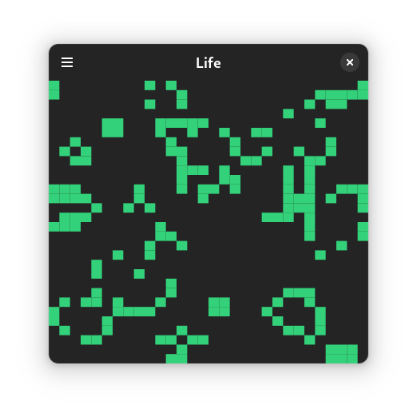
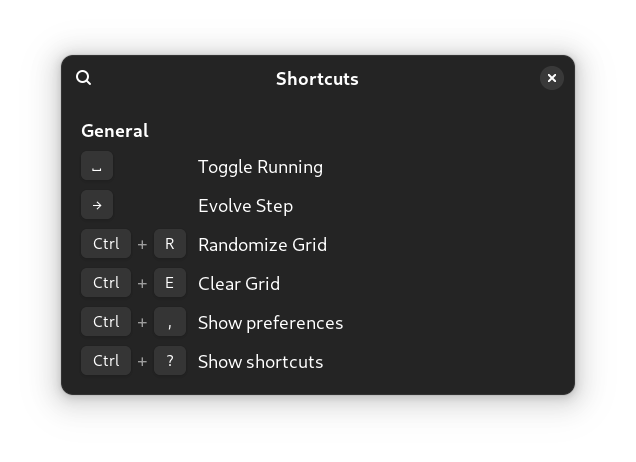
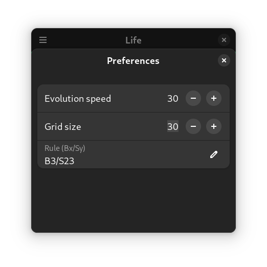

# Life

**Life** is a cellular automaton game, similar to Conway's Game of Life. It is written in Rust and uses libadwaita for the frontend.



## Installation

Make sure you have the following dependencies installed on your system:

- [Rust](https://www.rust-lang.org/tools/install)
- [GTK4](https://www.gtk.org/docs/installations/)
- [libadwaita](https://gnome.pages.gitlab.gnome.org/libadwaita/)

Once the dependencies are installed, you can install **Life** using Cargo:

```bash 
cargo install --git https://github.com/emjomi/life
```

## Usage

To start the game, simply run:

```bash
life
```

### Controls

The game can be controlled using keyboard shortcuts or the mouse (when the game is paused). For detailed keyboard shortcuts, refer to the shortcuts section:



### Preferences

To customize your game experience, visit the preferences page:


